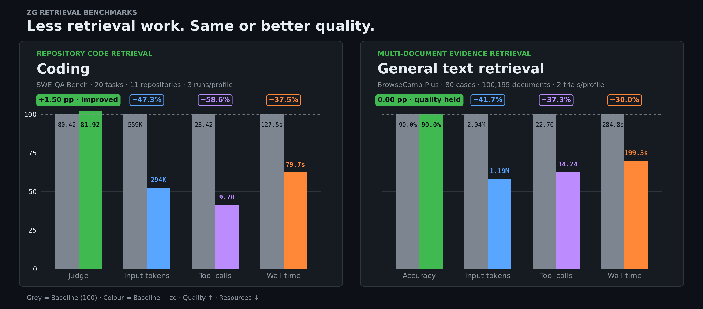
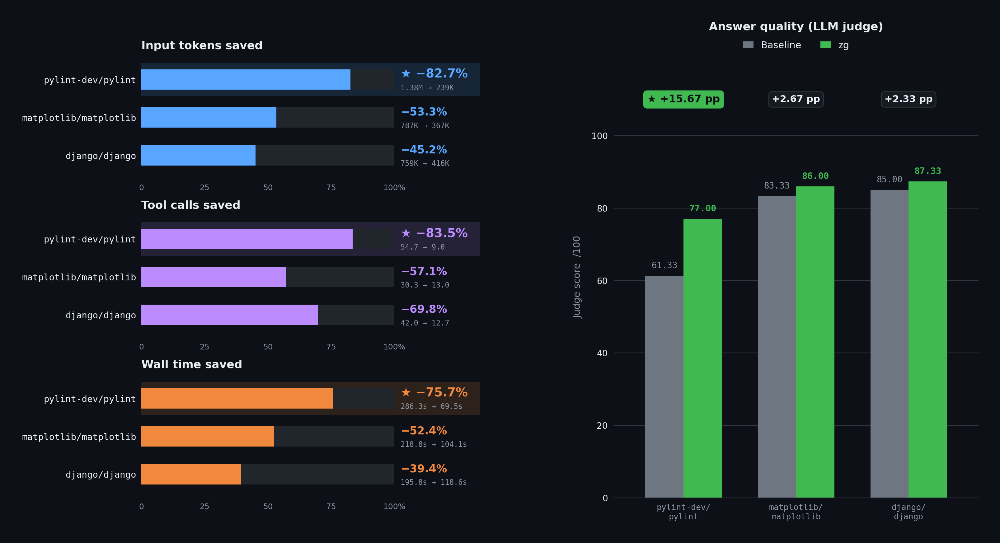

<p align="right">
  <a href="./README.md">English</a> | 中文
</p>

<div align="center">
  <picture>
    <source media="(prefers-color-scheme: dark)" srcset="./.github/assets/zg-logo-dark.svg">
    
  </picture>
  <p><strong>Know the words—or don’t. Just zg.</strong></p>
  <p>面向人与 Agent 的本地优先统一检索层。</p>

  <p>
    <a href="https://www.npmjs.com/package/@zvec/zvec-grep"></a>
    <a href="https://github.com/zvec-ai/zvec-grep/actions/workflows/ci.yml"></a>
    <a href="./LICENSE"></a>
    
  </p>

  <p>
    <a href="#tour">🎬 <strong>功能演示</strong></a> |
    <a href="#features">💫 <strong>核心特性</strong></a> |
    <a href="#try-it-yourself">🚀 <strong>动手体验</strong></a> |
    <a href="./docs/README.md">📚 <strong>文档</strong></a> |
    <a href="#benchmarks">📊 <strong>性能测试</strong></a> |
    <a href="#community">🤝 <strong>社区</strong></a>
  </p>
</div>

**zg**（**z**vec-**g**rep）将 ripgrep、BM25 与向量检索统一在一个
[本地优先的检索入口](./docs/05-architecture.md)中。既可以由人在终端中搜索，
也可以让 Agent 根据问题选择合适的本地检索方式。

<a id="tour"></a>

## 🎬 功能演示

<div align="center">
  
</div>

<a id="features"></a>

## 💫 为什么选择 zg？

- **人与 Agent 开箱即用**：安装一次、索引一次，即可在 macOS、Linux 和
  Windows 上通过 CLI 或 Agent 复用同一个工作区。
- **不止关键词搜索**：先按语义发现内容、按相关性排序，再在需要时使用精确文本
  或正则完成验证。
- **多格式检索**：搜索源代码、文档和结构化数据，同时保留有用的内容结构与
  来源位置。
- **更少搜索，更少上下文**：经过排序并保留来源的结果，可以减少工具调用、
  Token 消耗与无关噪声，更快找到所需证据。
- **默认本地运行**：文件、索引与本地模型都留在本机；只有经过你的授权，远程
  Embedding 服务才能接收数据。

<a id="try-it-yourself"></a>

## 🚀 动手体验

### 1. 准备示例书架

```bash
# 需要 Node.js 22 或更新版本。
npm install -g @zvec/zvec-grep

mkdir zg-mystery && cd zg-mystery
curl --retry 3 --retry-all-errors --progress-bar -fL \
  -o alice-in-wonderland.txt https://raw.githubusercontent.com/GITenberg/Alice-s-Adventures-in-Wonderland_11/master/11.txt \
  -o sherlock-holmes.txt https://raw.githubusercontent.com/GITenberg/The-Memoirs-of-Sherlock-Holmes_834/master/834.txt

zg index --embedding local/potion-retrieval-32m
```

### 2. 选择检索方式

#### Agent：通过 OpenCode 提问

配置好 [OpenCode](https://opencode.ai/) 后：

```bash
zg install --target opencode --yes
opencode run --model opencode/deepseek-v4-flash-free \
  "An unseen creature left a few marks. What did the detective infer? Cite local evidence."
```

Prompt 中没有指定任何工具，OpenCode 会自主选择 zg。

<details>
<summary><strong>展开查看完整 Agent 调用与回答</strong></summary>

```text
⚙ zvec_grep_zvec_grep_search {"root":".../zg-mystery","query":"An unseen creature left a few marks. What did the detective infer?","fts":["marks","unseen creature","inferred","detective"],"fuse":true}
→ Read sherlock-holmes.txt [offset=5440, limit=120]

Answer:
The detective is Sherlock Holmes in *The Adventure of the Crooked Man*.
From the animal's foot-marks, he inferred:

- It was not a dog, cat, monkey, or other familiar creature: its print had
  five foot-pads, long nails, and was nearly as large as a dessert-spoon
  (sherlock-holmes.txt:5479-5486).
- It had a long body and very short legs: nearly two feet long, but with a
  stride of only about three inches (sherlock-holmes.txt:5497-5502).
- It was carnivorous because it climbed the curtain toward a canary's cage
  (sherlock-holmes.txt:5509-5510).
- It was probably from the weasel or stoat tribe, though unusually large
  (sherlock-holmes.txt:5514-5516).

Holmes also inferred that a man entered through the window with it and later
left with the key (sherlock-holmes.txt:5464-5470, 5527-5528).
```

</details>

#### 用户：直接检索

不通过 Agent，直接搜索同一个书架：

```bash
zg query --human "An unseen creature left a few marks. What did the detective infer?" --limit 3
```

zg 会将 `sherlock-holmes.txt` 中的相关段落排在
`alice-in-wonderland.txt` 前面。

<a id="benchmarks"></a>

## 📊 性能测试

每项测试均采用配对 A/B 评测：任务、Agent/模型、Prompt、环境和
资源限制保持一致，仅 `zg` 访问权限及使用说明不同。

完整结果和复现细节参见[性能测试文档](./benchmarks/README_CN.md)。

### 1. 整体检索测试

[SWE-QA-Bench](./benchmarks/swe-qa-bench/README_CN.md) 使用 Claude Code 与
Claude Opus 5；[BrowseComp-Plus](./benchmarks/browse-comp-plus/README_CN.md)
使用 Codex `gpt-5.6-sol` 与 medium 推理强度。两项测试中的 zg
Profile 均使用 Qwen3.7 Text Embedding。

<p align="center">
  
</p>

- **为何有效：** 语义发现先收窄搜索范围，排序后的词法检索再锚定精确标识符；
  紧凑的证据结果减少了大范围扫描、重复工具调用和模型上下文。
- **为何通用：** 同一检索流程可以适配不同内容：代码索引保留符号、签名和
  层级路径，通用文本则按相关 section 与 chunk 返回证据。

zg 更适合证据分散在多个文件或模块中的问题，尤其是目标位置未知、需要
理解调用链、数据流或架构关系的场景。由于是否调用以及如何使用 zg 由 Agent
自主决定，结果也会受模型能力和采样随机性影响；因此，多次运行的汇总结果比单次
运行更具代表性。

### 2. 代表性仓库案例

<p align="center">
  
</p>

- **Pylint — Python 静态分析器：** 任务需要理解 AST 节点处理如何区分带标注与
  不带标注的属性初始化；由于架构入口事先未知，保留符号与层级路径的检索
  更适合定位相关实现。
- **Matplotlib — 绘图与渲染库：** 任务需要沿数学文本渲染的多个阶段追踪
  `FontInfo` 与字体选择；语义与词法联合排序有助于还原跨文件的数据流和控制流。
- **Django — Web 框架：** 任务关联 username 唯一约束、ORM 事务和 formset
  批量操作；紧凑的排序证据便于汇集分散在多处的设计依据。

<details>
<summary><strong>测试仓库与具体问题</strong></summary>

| 仓库 | 问题类型 | 具体问题 |
| --- | --- | --- |
| **`pylint-dev/pylint`** | What<br>架构探索 | 使用 AST 节点类型区分带类型标注和不带类型标注的实例属性初始化时，采用了什么架构模式？ |
| **`matplotlib/matplotlib`** | Where<br>数据 / 控制流 | `FontInfo` NamedTuple 在数学文本渲染 Pipeline 中如何传递字体度量和字形数据？控制流如何决定在字符渲染的不同阶段使用 `postscript_name` 还是 `FT2Font` 对象？ |
| **`django/django`** | Why<br>设计原理 | User 模型中 username 字段的唯一约束为什么会与 Django ORM 事务处理产生关联？如果在已有数据库中移除该约束，会对基于 formset 的批量操作产生哪些级联影响？ |

</details>

## 📚 文档

| 指南 | 你可以完成什么 |
| :--- | :--- |
| [Agent 集成](./docs/01-agents.md) | 将 zg 接入 Codex、Claude Code、Cursor 或 OpenCode，并验证是否正常工作。 |
| [CLI 指南](./docs/02-cli.md) | 在终端中搜索、索引和管理本地工作区。 |
| [MCP 指南](./docs/03-mcp.md) | 了解 Agent 可以使用哪些 zg 工具，以及访问权限如何受到保护。 |
| [检索 Pipeline](./docs/04-pipeline.md) | 选择索引范围、保持内容新鲜，并获得更好的检索结果。 |
| [架构](./docs/05-architecture.md) | 了解 zg 如何处理查询，以及数据会保留在哪里。 |
| [服务端与执行模式](./docs/06-server.md) | 在一次性命令和长期运行的本地服务之间选择。 |
| [Embedding 模型](./docs/07-embedding.md) | 根据速度、检索质量、隐私和本机硬件选择合适的模型。 |
| [Roadmap](./docs/08-roadmap.md) | 了解接下来的产品方向，并参与影响 zg 的优先级。 |

<a id="community"></a>

## 🤝 加入社区

<div align="center">

| 💬 钉钉群 | 📱 微信群 | 🎮 Discord | X (Twitter) |
| :---: | :---: | :---: | :---: |
|  |  | [](https://discord.gg/rKddFBBu9z) | [](<https://x.com/ZvecAI>) |
| 扫码加入 | 扫码加入 | 点击加入 | 点击关注 |

</div>

## ❤️ 参与贡献

始终欢迎社区贡献——缺陷修复、新功能和文档改进都会让 zvec-grep 变得更好。

请查阅我们的[贡献指南](./CONTRIBUTING.md)开始参与！
