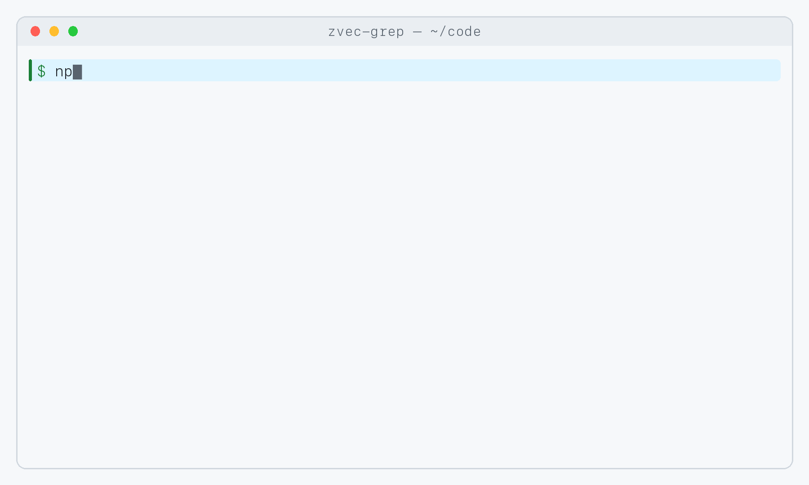
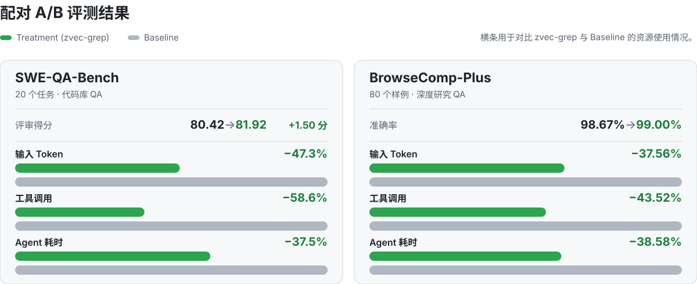

<p align="right">
  <a href="./README.md">English</a> | 中文
</p>

<div align="center">
  <picture>
    <source media="(prefers-color-scheme: dark)" srcset="./.github/assets/zg-logo-dark.svg">
    
  </picture>
  <p><strong>Know the words—or don’t. Just zg.</strong></p>
  <p>面向人与 Agent 的本地优先统一检索层。</p>

  <p>
    <a href="https://www.npmjs.com/package/@zvec/zvec-grep"></a>
    <a href="https://github.com/zvec-ai/zvec-grep/actions/workflows/ci.yml"></a>
    <a href="./LICENSE"></a>
    
  </p>

  <p>
    <a href="#tour">🎬 <strong>功能演示</strong></a> |
    <a href="#features">💫 <strong>核心特性</strong></a> |
    <a href="#try-it-yourself">🚀 <strong>动手体验</strong></a> |
    <a href="./docs/README.md">📚 <strong>文档</strong></a> |
    <a href="#benchmarks">📊 <strong>性能测试</strong></a> |
    <a href="#community">🤝 <strong>社区</strong></a>
  </p>
</div>

**zg**（**z**vec-**g**rep）将 ripgrep、BM25 与向量检索统一在一个
[本地优先的检索入口](./docs/05-architecture.md)中。既可以由人在终端中搜索，
也可以让 Agent 根据问题选择合适的本地检索方式。

<a id="tour"></a>

## 🎬 功能演示

<div align="center">
  
</div>

<a id="features"></a>

## 💫 为什么选择 zg？

- **人与 Agent 开箱即用**：安装一次、索引一次，即可在 macOS、Linux 和
  Windows 上通过 CLI 或 Agent 复用同一个工作区。
- **不止关键词搜索**：先按语义发现内容、按相关性排序，再在需要时使用精确文本
  或正则完成验证。
- **多格式检索**：搜索源代码、文档和结构化数据，同时保留有用的内容结构与
  来源位置。
- **图关系代码探索**：追踪调用、引用、继承和实例化关系；interface、trait 与
  virtual dispatch 无法唯一确定时，会返回带置信度的动态候选，而不是伪造精确边。
- **更少搜索，更少上下文**：经过排序并保留来源的结果，可以减少工具调用、
  Token 消耗与无关噪声，更快找到所需证据。
- **默认本地运行**：文件、索引与本地模型都留在本机；只有经过你的授权，远程
  Embedding 服务才能接收数据。

<a id="try-it-yourself"></a>

## 🚀 动手体验

### 1. 准备示例书架

```bash
# 需要 Node.js 22 或更新版本。
npm install -g @zvec/zvec-grep

mkdir zg-mystery && cd zg-mystery
curl --retry 3 --retry-all-errors --progress-bar -fL \
  -o alice-in-wonderland.txt https://raw.githubusercontent.com/GITenberg/Alice-s-Adventures-in-Wonderland_11/master/11.txt \
  -o sherlock-holmes.txt https://raw.githubusercontent.com/GITenberg/The-Memoirs-of-Sherlock-Holmes_834/master/834.txt

zg index --embedding local/potion-retrieval-32m
```

### 2. 选择检索方式

#### Agent：通过 OpenCode 提问

配置好 [OpenCode](https://opencode.ai/) 后：

```bash
zg install --target opencode --yes
opencode run --model opencode/deepseek-v4-flash-free \
  "An unseen creature left a few marks. What did the detective infer? Cite local evidence."
```

Prompt 中没有指定任何工具，OpenCode 会自主选择 zg。

<details>
<summary><strong>展开查看完整 Agent 调用与回答</strong></summary>

```text
⚙ zvec_grep_zvec_grep_search {"root":".../zg-mystery","query":"An unseen creature left a few marks. What did the detective infer?","fts":["marks","unseen creature","inferred","detective"],"fuse":true}
→ Read sherlock-holmes.txt [offset=5440, limit=120]

Answer:
The detective is Sherlock Holmes in *The Adventure of the Crooked Man*.
From the animal's foot-marks, he inferred:

- It was not a dog, cat, monkey, or other familiar creature: its print had
  five foot-pads, long nails, and was nearly as large as a dessert-spoon
  (sherlock-holmes.txt:5479-5486).
- It had a long body and very short legs: nearly two feet long, but with a
  stride of only about three inches (sherlock-holmes.txt:5497-5502).
- It was carnivorous because it climbed the curtain toward a canary's cage
  (sherlock-holmes.txt:5509-5510).
- It was probably from the weasel or stoat tribe, though unusually large
  (sherlock-holmes.txt:5514-5516).

Holmes also inferred that a man entered through the window with it and later
left with the key (sherlock-holmes.txt:5464-5470, 5527-5528).
```

</details>

#### 用户：直接检索

不通过 Agent，直接搜索同一个书架：

```bash
zg query --human "An unseen creature left a few marks. What did the detective infer?" --limit 3
```

zg 会将 `sherlock-holmes.txt` 中的相关段落排在
`alice-in-wonderland.txt` 前面。

<a id="benchmarks"></a>

## 📊 性能测试

zg 通过**缩小有效搜索空间**，帮助 Agent 更快找到相关证据 —— 在保持回答质量的同时，使用**更少的 Token、工具调用和时间**。

每项测试均采用**受控、可复现的配对 A/B 评测**：同一个 Agent 在完全相同的模型、Prompt、环境和资源限制下执行同一组预先固定的任务；**实验组仅额外提供 `zg` 工具及其使用说明**。



| 测试 | 回答质量&nbsp;↑ | 平均输入&nbsp;Token&nbsp;↓ | 平均工具调用&nbsp;↓ | 平均&nbsp;Agent&nbsp;耗时&nbsp;↓ |
| --- | ---: | ---: | ---: | ---: |
| [**SWE-QA-Bench**](./benchmarks/swe-qa-bench/README_CN.md)<br>20 个任务 · 代码库 QA | 评审得分<br>80.42&nbsp;→&nbsp;81.92 | 558,651&nbsp;→&nbsp;294,262 | 23.42&nbsp;→&nbsp;9.70 | 127.5s&nbsp;→&nbsp;79.7s |
| [**BrowseComp-Plus**](./benchmarks/browse-comp-plus/README_CN.md)<br>80 个样例 · 深度研究 QA | 准确率<br>90.00%&nbsp;→&nbsp;90.00% | 2.04M&nbsp;→&nbsp;1.19M | 22.70&nbsp;→&nbsp;14.24 | 284.8s&nbsp;→&nbsp;199.3s |

表中数值均按 **Baseline → zg** 展示。

完整结果和复现细节参见[性能测试文档](./benchmarks/README_CN.md)。

## 📚 文档

| 指南 | 你可以完成什么 |
| :--- | :--- |
| [Agent 集成](./docs/01-agents.md) | 将 zg 接入 Codex、Claude Code、Cursor 或 OpenCode，并验证是否正常工作。 |
| [CLI 指南](./docs/02-cli.md) | 在终端中搜索、索引和管理本地工作区。 |
| [MCP 指南](./docs/03-mcp.md) | 了解 Agent 可以使用哪些 zg 工具，以及访问权限如何受到保护。 |
| [检索 Pipeline](./docs/04-pipeline.md) | 选择索引范围、保持内容新鲜，并获得更好的检索结果。 |
| [架构](./docs/05-architecture.md) | 了解 zg 如何处理查询，以及数据会保留在哪里。 |
| [服务端与执行模式](./docs/06-server.md) | 在一次性命令和长期运行的本地服务之间选择。 |
| [Embedding 模型](./docs/07-embedding.md) | 根据速度、检索质量、隐私和本机硬件选择合适的模型。 |
| [Roadmap](./docs/08-roadmap.md) | 了解接下来的产品方向，并参与影响 zg 的优先级。 |
| [Graph](./docs/09-graph.md) | 了解图索引、关系增强检索、动态分派和 Explore 输出。 |

<a id="community"></a>

## 🤝 加入社区

<div align="center">

| 💬 钉钉群 | 📱 微信群 | 🎮 Discord | X (Twitter) |
| :---: | :---: | :---: | :---: |
|  |  | [](https://discord.gg/rKddFBBu9z) | [](<https://x.com/ZvecAI>) |
| 扫码加入 | 扫码加入 | 点击加入 | 点击关注 |

</div>

## ❤️ 参与贡献

始终欢迎社区贡献——缺陷修复、新功能和文档改进都会让 zvec-grep 变得更好。

请查阅我们的[贡献指南](./CONTRIBUTING.md)开始参与！
