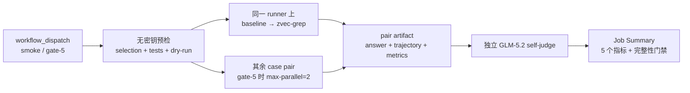

# SWE-QA-Bench 手工 CI 设计

本流程接入的是 [`peng-weihan/SWE-QA-Bench`](https://github.com/peng-weihan/SWE-QA-Bench)，不是 SWE-QA-Pro。题目锁定在上游 commit `c13deac7a0d99b0ca2e593e004c4739475785b08`，只允许通过 GitHub `workflow_dispatch` 人工触发，不参与 PR 或分支保护。

## 固定任务集

| CI 名称 | 原始索引（0-based） | 角色 | 类型 | 仓库 |
| --- | --- | --- | --- | --- |
| `reflex-6` | `reflex:6` | Smoke | What | `reflex-dev/reflex` |
| `sqlfluff-2` | `sqlfluff:2` | Gate | What | `sqlfluff/sqlfluff` |
| `sympy-38` | `sympy:38` | Gate | Where | `sympy/sympy` |
| `streamlink-14` | `streamlink:14` | Gate | How | `streamlink/streamlink` |
| `pylint-25` | `pylint:25` | Gate | Why | `pylint-dev/pylint` |

截图候选中没有 Why 类型题；为满足“1 smoke + What/Where/How/Why”这一硬约束，前四题取自截图，Why 题从同一官方 benchmark 补充为 `pylint:25`。

`selection.json` 同时锁定完整 question、question SHA-256、目标仓库完整 commit SHA 和题型。`validate` 在任何模型调用前验证这些字段、Harbor instruction 与 reference 的一致性，并检查 reference answer 没有进入 Harbor dataset。

## 执行拓扑



矩阵维度是 case，不是 profile。每个 case 的 baseline 和 zvec-grep 在同一台 GitHub-hosted Ubuntu runner 上顺序运行，使用同一题目镜像、仓库 commit、OpenCode 版本和 GLM-5.2 endpoint。这样保留严格的成对比较；任一侧失败都不会被当成 0 分或从聚合中静默剔除。

## 模型与检索配置

- Agent：Harbor `0.18.0` + OpenCode `1.18.4`。
- Agent 模型：`custom-openai/glm-5.2`，OpenAI-compatible endpoint 固定在代码配置中。
- Judge 模型：同一 endpoint 的 GLM-5.2，温度 `0`，因此报告明确标记为 `glm-5.2-self-judge-v1`。
- zvec-grep embedding：`local/potion-code-16m-v2`。本地模型不需要 embedding key，也不会创建远端 embedding 授权。
- baseline 不安装或暴露 zvec-grep；zvec-grep profile 使用当前 checkout `npm pack` 的产物。

`.opencode/opencode.json` 只引用 `{env:GLM_API_KEY}`。真实值只保存为仓库 Actions Secret `GLM_API_KEY`，仅注入模型执行或 Judge step，不进入命令参数、Git 或 artifact。上传 artifact 前还会做精确 secret 内容扫描。

## Judge 与五项指标

Judge 按 SWE-QA 的五个维度分别打 `1–20` 分：correctness、completeness、relevance、clarity、coherence，总分范围 `5–100`。reference answer 只在独立 Judge job 中读取，Agent 容器不可见。

Job Summary 对每个 case 和 Aggregate 展示：

1. `Judge`：baseline、zvec-grep、差值；
2. `input_token`：Agent 输入 token，Judge token 单独记录、不混入；
3. `toolcall`：Agent trajectory 的工具调用数；
4. `time`：Agent execution wall time，索引 setup 仍保留在原始证据中；
5. `cost`：OpenCode/provider 回传的 Agent 美元成本。若 endpoint 不回传真实价格，显示 `N/A`，不把未知成本伪装成 0。

token、toolcall、time 和 cost 同时给出 baseline/zvec-grep 及降低比例。Judge 原始结构化结果、pair JSON、Harbor result、日志与 ATIF trajectory 均作为 artifact 保存。

## 当前门禁语义

当前是影子运行（report-only），没有数值质量或效率阈值，也不会成为代码审核卡点。唯一硬门禁是运行完整性：所选 scope 的每个 case 都必须生成有效的 baseline/zvec-grep pair、非空答案和可解析 Judge 结果。

- `smoke`：只跑 `reflex-6` 的 1 个 pair；
- `gate-5`：跑 5 个 pair，即 10 次 Agent 执行，再逐答案 Judge；
- `fail-fast: false`，便于一次收集所有 case 的失败证据；
- Agent 每侧最多 30 分钟，pair job 最多 120 分钟，Judge/report 最多 30 分钟；
- 付费 workflow 不自动取消；原始证据保留 30 天，聚合报告保留 90 天。

至少积累 5 次独立 shadow run 后再冻结数值阈值。届时建议把质量（Judge delta/绝对下限）和效率（token/toolcall）设为相互独立的门禁，避免节省资源抵消明显质量退化。

## 触发方式

在 GitHub Actions 中选择 **SWE-QA Bench (manual)**，点击 **Run workflow**，选择 `smoke` 或 `gate-5`。CLI 等价命令为：

```bash
uv run --project benchmarks/coding zg-bench run \
  swe-qa-bench-manual \
  --tier ci \
  --task reflex-6 \
  --agent opencode \
  --model custom-openai/glm-5.2 \
  --profile all \
  --embedding-model local/potion-code-16m-v2 \
  --zvec-grep-package "$PWD"
```
