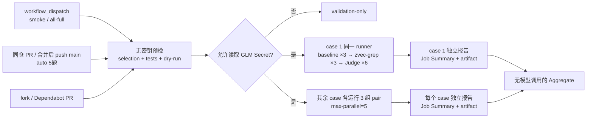

# SWE-QA-Bench CI 设计

本流程接入的是 [`peng-weihan/SWE-QA-Bench`](https://github.com/peng-weihan/SWE-QA-Bench)，不是 SWE-QA-Pro。题目锁定在上游 commit `c13deac7a0d99b0ca2e593e004c4739475785b08`。20 题 **All-Full** 只允许通过 GitHub `workflow_dispatch` 人工触发；同仓 pull request 和合并完成后推送到 `main` 时自动运行 5 题精选集。fork/Dependabot PR 仍执行不需要凭证的 validation，但跳过需要 `GLM_API_KEY` 的 benchmark job，因此不会向不受信任代码暴露 Secret。

## 固定任务集

| CI 名称 | 原始索引（0-based） | 角色 | 类型 | 仓库 |
| --- | --- | --- | --- | --- |
| `reflex-6` | `reflex:6` | Smoke | What | `reflex-dev/reflex` |
| `sqlfluff-2` | `sqlfluff:2` | Gate | What | `sqlfluff/sqlfluff` |
| `conan-1` | `conan:1` | Gate | What | `conan-io/conan` |
| `pylint-10` | `pylint:10` | Gate | What | `pylint-dev/pylint` |
| `pylint-9` | `pylint:9` | Gate | What | `pylint-dev/pylint` |
| `sympy-38` | `sympy:38` | Gate | Where | `sympy/sympy` |
| `conan-39` | `conan:39` | Gate | Where | `conan-io/conan` |
| `xarray-46` | `xarray:46` | Gate | Where | `pydata/xarray` |
| `astropy-38` | `astropy:38` | Gate | Where | `astropy/astropy` |
| `matplotlib-37` | `matplotlib:37` | Gate | Where | `matplotlib/matplotlib` |
| `streamlink-14` | `streamlink:14` | Gate | How | `streamlink/streamlink` |
| `conan-19` | `conan:19` | Gate | How | `conan-io/conan` |
| `django-21` | `django:21` | Gate | How | `django/django` |
| `pylint-14` | `pylint:14` | Gate | How | `pylint-dev/pylint` |
| `requests-16` | `requests:16` | Gate | How | `psf/requests` |
| `django-32` | `django:32` | Gate | Why | `django/django` |
| `xarray-32` | `xarray:32` | Gate | Why | `pydata/xarray` |
| `streamlink-43` | `streamlink:43` | Gate | Why | `streamlink/streamlink` |
| `sympy-26` | `sympy:26` | Gate | Why | `sympy/sympy` |
| `conan-27` | `conan:27` | Gate | Why | `conan-io/conan` |

该集合与当前本地 20-task 基准会话保持一致，What、Where、How、Why 各 5 题。它完整替换原 5-task 集合而不是与其求并集；旧集合中的 `pylint:25` 已移除，另外 4 个重合任务仅因它们本身属于新 20 题而继续保留。该本地会话最初使用上游 revision `d7bf283d65f4bbdc86ead92fc130eee4986355f0`；这 20 行的 question/reference 与本 CI 已锁定的后续 revision `c13deac7a0d99b0ca2e593e004c4739475785b08` 逐字一致，因此 CI 保留原有的后续固定 revision。

`selection.json` 同时锁定完整 question、question SHA-256、目标仓库完整 commit SHA 和题型。`validate` 在任何模型调用前验证这些字段、Harbor instruction 与 reference 的一致性，并检查 reference answer 没有进入 Harbor dataset。workflow 的 matrix、Aggregate 期望报告数和精确 task ID 集合均从通过校验的 selection 动态生成，YAML 不再维护第二份任务列表。

### 自动精选集

`selection.json` 的 `gate.auto_tasks` 按顺序锁定 `reflex:6`（Smoke）、`pylint:9`（What）、`matplotlib:37`（Where）、`streamlink:14`（How）和 `xarray:32`（Why）。validation 要求它正好包含 1 个 smoke，以及依次覆盖 What、Where、How、Why 的 4 个 category task，防止自动矩阵与设计意外漂移。

这 4 个分类代表题来自本轮 All-Full 结果中各题型在 profile-mean 口径下表现较好的样本，同时保留原 smoke 作为快速链路检查：`reflex:6` 的 Judge 为 `+0.33`，input/tool/time 分别改善约 `20.01% / 38.52% / 12.71%`；`pylint:9` 为 `+42.33` 和约 `40.24% / 34.28% / 40.46%`；`matplotlib:37` 为 `+3.33` 和约 `20.88% / 29.28% / 41.82%`；`streamlink:14` 为 `+11.33` 和约 `7.22% / 27.83% / 40.43%`；`xarray:32` 为 `+1.33`，tool/time 改善约 `6.81% / 6.33%`，但 input 约回退 `16.29%`，有意保留一个不完全偏向效率胜出的样本。精选依据用于控制自动 CI 成本并覆盖四种问题类型；workflow 始终采用 completion-only 门禁，不把这些数值设为合并阈值。

## 执行拓扑



矩阵维度是 case，不是 profile。每个 case 的 baseline 和 zvec-grep 在同一台 GitHub-hosted Ubuntu runner 上各执行 3 个独立 Harbor trial（`--n-attempts 3`，`--n-concurrent 1`），随后对 6 个答案分别执行 Judge，并生成该 case 自己的 Job Summary 与报告 artifact。单任务表中的 baseline/zvec-grep 原始指标是各自 3 次 trial 的算术平均，第三个 delta/reduction 直接由表中展示的这两个 profile mean 计算。两侧 trial 仍按实际启动时间恢复第 1/2/3 轮，同轮 comparison 仅作为诊断证据，不参与单任务或 Aggregate 主指标。所有成功的单任务报告最后由一个不调用模型的 job 合并。这样既保留重复实验的波动证据，也不会把失败 trial 当成 0 分或静默剔除。

All-Full 的 20 个 case 以 `max-parallel: 5` 分批占用 runner；自动精选的 5 个 case 可在一个 wave 内完成。每个 matrix task 在 Harbor 启动前从 Actions cache 恢复自己的 zvec index seed 到 `$RUNNER_TEMP/swe-qa-index-seed`，并通过 `ZG_BENCH_INDEX_SEED_DIR` 交给 benchmark/Harbor。cache miss 时，第 1 个 zvec-grep trial 冷建 seed，后两个 trial 从 seed 独立初始化；cache hit 时直接使用此前成功 workflow 保存的同任务 seed。seed 只表示可复用的初始索引快照，不共享 Agent 会话或可写运行状态，因此 3 个 trial 仍分别拥有独立的模型调用、trajectory、指标和 Judge 结果。host seed 不会 bind mount 到受评容器；Harbor 的可信 setup 代码只在模型 Agent 启动前通过 `upload_dir`/`download_dir` 传输快照，所以 Agent 无法回写 seed 或污染后续 trial。

缓存严格按 runner OS/arch 和 task 隔离。key 还分别包含锁定的 `selection.json`、`references.json`、该 task 的 dataset Dockerfile、`package-lock.json`，以及 zvec-grep TypeScript 源码、构建配置、benchmark adapter/依赖锁和 skill 的哈希；不使用 fallback `restore-keys`，任一输入变化都会冷建新 seed。key 不包含 API key 等凭证，seed 目录也会和报告 artifact 一起接受精确 secret 扫描；只有 cache miss 且 matrix task 完整成功时才保存。

单任务报告和原始 pair 证据都使用 `task + run_id + run_attempt` 的唯一名称，因此历史结果不会因重跑而丢失。Aggregate 只读取同一 attempt 的单任务报告，并且不会重复调用 Judge：首次完整运行或 **Re-run all jobs** 会生成 Aggregate；只重跑一个 matrix job 时，该任务仍生成完整独立报告，Aggregate 不构造跨任务汇总，但会在自己的 Job Summary 中直接嵌入当前 attempt 的单任务指标表，并明确标记为 partial rerun。这样既避免混合不同 attempt，也不需要跳转到 matrix job 才能查看结果。

## 模型与检索配置

- Agent：Harbor `0.18.0` + OpenCode `1.18.4`。
- Agent 模型：`custom-openai/glm-5.2`，OpenAI-compatible endpoint 固定在代码配置中。
- Judge 模型：同一 endpoint 的 GLM-5.2，温度 `0`，因此报告明确标记为 `glm-5.2-self-judge-v1`。
- zvec-grep embedding：`local/potion-code-16m-v2`。本地模型不需要 embedding key，也不会创建远端 embedding 授权。
- baseline 不安装或暴露 zvec-grep；zvec-grep profile 使用当前 checkout `npm pack` 的产物。

`.opencode/opencode.json` 只引用 `{env:GLM_API_KEY}`。真实值只保存为仓库 Actions Secret `GLM_API_KEY`，仅注入模型执行或 Judge step，不进入命令参数、Git 或 artifact。上传 pair 和单任务报告前还会做精确 secret 内容扫描。

## Judge 与四项指标

Judge 按 SWE-QA 的五个维度分别打 `1–20` 分：correctness、completeness、relevance、clarity、coherence，总分范围 `5–100`。reference answer 只在 Agent 执行结束后的 Judge step 中读取，Agent 容器不可见。每个 case 的 baseline 3 个答案和 zvec-grep 3 个答案逐一评分，报告保留 6 份原始 Judge 结果并展示各侧均值。Aggregate 只合并这些已经完成的结果，不会重评。

Job Summary 对每个 case 和 Aggregate 展示：

1. `Judge`：baseline、zvec-grep、差值；
2. `input_token`：Agent 输入 token，Judge token 单独记录、不混入；
3. `toolcall`：Agent trajectory 的工具调用数；
4. `time`：Agent execution wall time，索引 setup 仍保留在原始证据中。

input_token、toolcall 和 time 同时给出 baseline/zvec-grep 的 3-trial 均值及降低比例。单任务第三个值由展示的 baseline 与 zvec-grep profile means 直接计算；跨任务 Aggregate 再对各 case 的 comparison 等权平均，而不是先加总所有任务的数据再反推比例。逐 trial comparison 只用于诊断。Judge 原始结构化结果、pair JSON、Harbor result、日志与 ATIF trajectory 均作为 artifact 保存。

## 当前门禁语义

当前是影子运行（report-only），没有数值质量或效率阈值。自动 workflow 可以作为运行完整性检查，但分数本身不会阻止合并；唯一硬门禁是所选 scope 的每个 case 都必须生成有效的 baseline/zvec-grep pair、非空答案和可解析 Judge 结果。

- `smoke`：只跑 `reflex-6`，即 3 次 baseline + 3 次 zvec-grep，共 6 次 Agent 执行和 6 次 Judge；
- 自动精选：5 个 case 各跑 3 组 pair，共 30 次 Agent 执行和 30 次 Judge，相比 All-Full 减少 75%；
- `all-full`：20 个 case 各跑 3 组 pair，共 120 次 Agent 执行和 120 次 Judge；历史 API 调用中的 `gate-20` 仍作为隐藏同义值兼容；
- 所有 scope 都允许 `max-parallel: 5`，但每个 case 内仍以 `--n-concurrent 1` 顺序运行；
- `fail-fast: false`，便于一次收集所有 case 的失败证据；
- 每个 Agent trial 最多 30 分钟，包含 6 个 trial 与 Judge 的单任务 job 最多 240 分钟，纯聚合 job 最多 15 分钟；
- 付费 workflow 不自动取消；原始证据保留 30 天，单任务和聚合报告保留 90 天。

需要重跑某一个 case 时，在 Actions 页面选择对应的 `Pair + judge / <task>` job。该 job 会同时重做 pair、Judge 和独立报告；后续 Aggregate 将这次执行识别为 partial rerun，在 Aggregate Job Summary 中直接展示本次任务的指标表，同时跳过跨任务合并，因此不会再报“缺少其他任务的 Judge 报告”。partial rerun 不上传 Aggregate artifact；如需新的跨任务 Aggregate，使用 **Re-run all jobs**。

至少积累 5 次独立 shadow run 后再冻结数值阈值。届时建议把质量（Judge delta/绝对下限）和效率（token/toolcall）设为相互独立的门禁，避免节省资源抵消明显质量退化。

## 触发方式

同仓 pull request 或合并完成后的 push 到 `main` 会自动选择 `gate.auto_tasks` 的 5 题；fork/Dependabot PR 只运行 validation 并跳过 Secret-backed benchmark。merge queue 不在候选合并 ref 上运行需要 Secret 的 benchmark，避免不受信任候选代码接触 `GLM_API_KEY`。手工运行时，在 GitHub Actions 中选择 **SWE-QA Bench**，点击 **Run workflow**，选择 `smoke` 或 `all-full`。CLI 等价命令为：

```bash
uv run --project benchmarks/coding zg-bench run \
  swe-qa-bench-manual \
  --tier ci \
  --task reflex-6 \
  --agent opencode \
  --model custom-openai/glm-5.2 \
  --profile all \
  --n-attempts 3 \
  --embedding-model local/potion-code-16m-v2 \
  --zvec-grep-package "$PWD"
```
