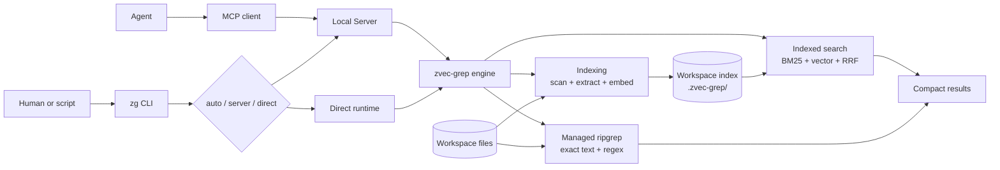

# Architecture

[Documentation](./README.md) · [Agents](./01-agents.md) ·
[CLI](./02-cli.md) · [MCP](./03-mcp.md) · [Pipeline](./04-pipeline.md) ·
[Architecture](./05-architecture.md) · [Server](./06-server.md) ·
[Embedding](./07-embedding.md) · [Roadmap](./08-roadmap.md)

zg presents one search layer to people and agents while keeping execution,
retrieval, and storage local by default.

## System at a glance

## Entry and execution

People and scripts enter through the CLI. Agents normally enter through the
local Streamable HTTP MCP endpoint configured by `zg --install`.

The CLI routes indexed operations through `auto`, `server`, or `direct` mode.
Both Server and Direct modes call the same engine; the difference is process
lifetime and coordination, not search behavior. MCP requests always arrive
through the Server. Managed `zg --rg` can run directly without a Server
or index.

See [Agent integrations](./01-agents.md), [CLI](./02-cli.md),
[MCP](./03-mcp.md), and [Server and execution modes](./06-server.md) for the
individual interfaces.

## Retrieval paths

The engine exposes two complementary paths behind the same product boundary:

| Path | Best for | Data source |
| --- | --- | --- |
| Indexed retrieval | Intent, related concepts, and ranked keywords | BM25/FTS and vector data in the workspace index |
| Managed ripgrep | Known text, symbols, paths, and regular expressions | Workspace files scanned directly |

Indexed search can combine lexical and vector candidates and fuse their ranks
with reciprocal rank fusion (RRF). Managed ripgrep is exhaustive by default and
does not require an Embedding model. Both paths apply workspace-aware filtering
and return file-oriented results suitable for terminal reading or agent context.

The [Retrieval pipeline](./04-pipeline.md) covers indexing, freshness, filters,
and route selection in detail.

## State and trust boundary

The normal repository index lives under `<workspace>/.zvec-grep/`. Global
configuration and daemon state live under `~/.zvec-grep/`. Workspace scanning,
managed ripgrep, index storage, and local Embedding models remain on the local
machine, and the Server listens on loopback only.

Selecting a remote Embedding provider is the one path that can send query text
or workspace content outside the machine. zg requests explicit once-only or
workspace authorization before that transfer. MCP Bearer authentication protects
the local endpoint; it does not authorize remote Embedding.

See [Embedding models](./07-embedding.md#remote-embedding-and-authorization)
for provider authorization and
[Server authentication](./06-server.md#bearer-authentication) for the local
endpoint boundary.
